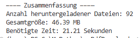

# PDF Downloader

Python-Skript, um alle PDF-Dateien einer Webseite herunterzuladen.

## Voraussetzungen
- Python 3.7+
- Virtual Environment (obligatorisch)

## Installation

1. Repository klonen:
   ```bash
   git clone [https://.../pdf-downloader.git](https://github.com/DonHanso/py_pdfdownloader.git)
   cd py_pdfdownloader
   ```
2. Virtual Environment erstellen und aktivieren:
   ```bash
   python3 -m venv env_pdfdownloader
   source env_pdfdownloader/bin/activate  # Linux/Macpython
   env_pdfdownloader\Scripts\activate     # Windows PowerShell
   ```
3. Abhängigkeiten installieren:
   ```bash
   pip install -r requirements.txt
   ```

## Nutzung

```bash
python downloader.py <URL> [-o <OUTPUT_DIR>]

oder 

python downloader_extended.py <URL> [-o <OUTPUT_DIR>]
``` 
Die zweite Variante zeigt nach Ausführung eine Zusammenfassung der Downloads an: 



## Optionen
- `<URL>`: Ziel-Webseite mit PDF-Links.
- `-o, --output`: Zielverzeichnis (Standard: `pdfs`).

---
